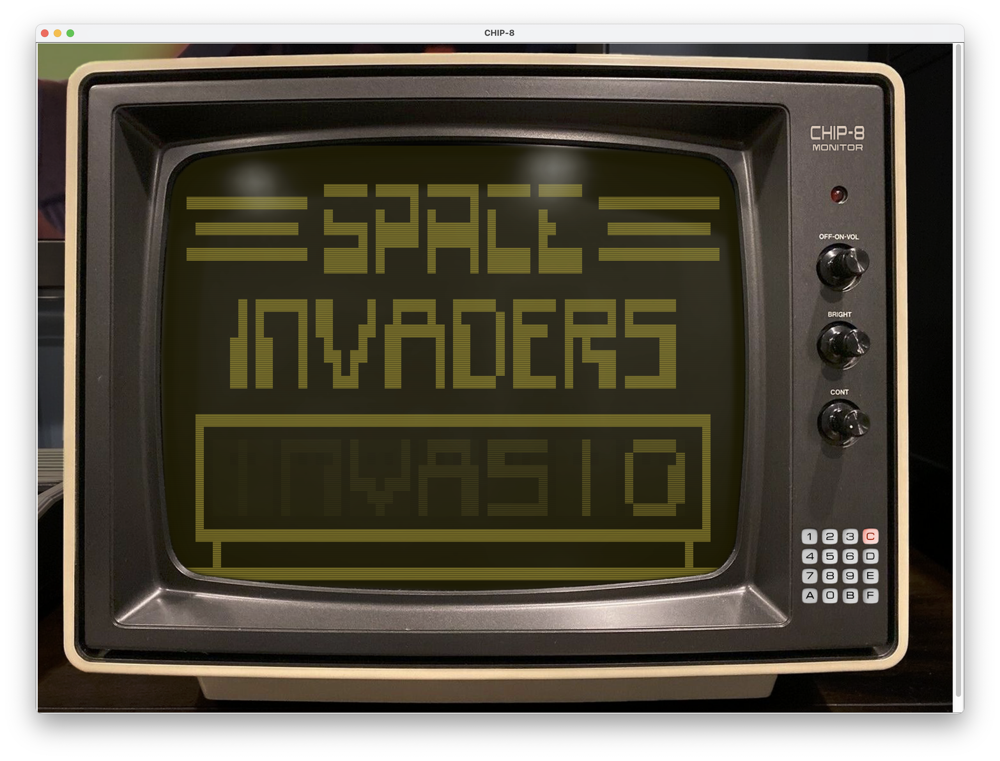
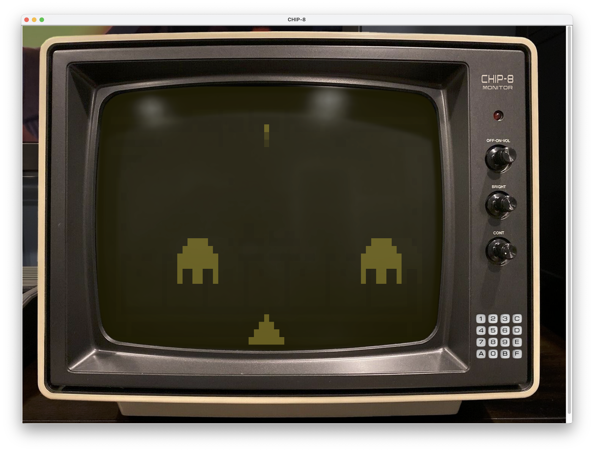

= CHIP-8 screen

A generic UI screen for any CHIP-8 implementations.

== Core functionality

=== Screen

The screen UI offer a 64x32 pixel screen and sound output. The screen colors are configurable.

The screen tries to emulate slow phosphorus fade on the old CRT monitors.

=== Sound

Sound/beeps is not only audible as usual but is also visual through the monitor red LED.

=== Key press input

The monitor visualizes what keys are pressed on the keyboard. The pressed keys light up on the monitor on the https://en.wikipedia.org/wiki/COSMAC_VIP[COSMAC VIP] inspired key display.

The COSMAC VIP keys 0-9, A-F are mapped to the corresponding physical keys `1234 qwer asdf zxcv` on a qwerty keyboard.

----
QWERTY       COSMAC VIP

1 2 3 4      1 2 3 C
q w e r      4 5 6 D
a s d f      7 8 9 E
z x c v      A 0 B F
----

NOTE: It is not tested, but the physical keyboard keys should be the same on any keyboard. The input is not mapped to the characters but the actual keys.

== Examples

.CHIP-8 UI - Brix game play
image::documentation/images/chip8-screen-brix.png[CHIP-8 UI - Brix game play]

.CHIP-8 UI - Pong game play
image::documentation/images/chip8-screen-pong.png[CHIP-8 UI - Pong game play]

.CHIP-8 UI - Space invaders game

.CHIP-8 UI - Space invaders game play

== Purpose of this project

This is an attempt to create a generic UI for peripherals for CHIP-8 implementations.
Most CHIP-8 computer implementations basics are pretty much straight forward,
but they all face problems that occur when it's time to implement

* a monitor/screen interface
* sound 
* key press detection (preferably multiple keys at the same time)

This project aim to solve those problems by offering a generic UI and to have a loose coupled interface (UDP data packets) for its communication.

== Limitations 

* Advanced sound, other than continuous beeps of some length is not supported. 1bit "sound sample" playback is not supported.

== Prerequisites

* Java is needed to (compile and) run the application.
* Maven build system is used

== How to build and run

You need java compiler and maven build-system installed on your machine.

.Compile; result jar-file end up in `target` directory
[source, bash]
----
mvn clean package
----

.Run; run the result jar-file end in the `target` directory
[source, bash]
----
java -jar target/chip8-screen.jar
----

=== Usage

====
usage: Chip8Screen [-c <arg>] [-ca <arg>] [-h] [-lp <arg>]

-c,--color <arg>            The RGB hex color for the bright (lit) color
on the monochrome screen. Format for the RGB
color value is "#RRGGBB". Default value is
"#"
-ca,--chip8-address <arg>   The UDP address for the CHIP-8 application.
The address should be an IPv4 address
including port like "127.0.0.1:9998". This is
the address and port where the CHIP-8
application listen for keypress status
messages. Default, if not specified, is
"localhost:9998".
-h,--help                   Show this help
-lp,--listener-port <arg>   The listener port where the screen
application listen for UDP packets with
screen and sound updates. Default, if not
specified, is 9999.

====

== Communication interface

To be able to communicate with this CHIP-8 screen you need three things in your CHIP-8 emulator.

1. A way to encode your data in msgpack format. MsgPack is a way to package structured data, much like textual JSON and yaml, but in a binary and much more efficient form (with respect to encode, decode and message size).
2. A way to send UDP data packet messages. You need to send the chip-8 screen memory and sound state on/off to this screen application.
3. A way to receive UDP data packet messages. This screen application captures key press events and send the key press state back to the chip-8 emulator. These messages are really simple just a 16bit integer (2 bytes).

Communication between chip-8 emulator and this screen UI is a two-way communication.
Video memory state, sound state, and key press state(!) is sent from the chip-8 emulator to this screen application. This screen application capture key press events and send the key press state to the chip-8 emulator for the key press instructions.

NOTE: The key states are captured in this screen application UI and sent to the chip-8 emulator application.
The chip-8 application should store this key state and return its state back to the screen application as an acknowledgement that the keys are received. The screen application will also show, in the UI, which buttons are pressed solely on the key state sent from the chip8-emulator.

=== Construct a screen, and sound state message

The chip-8 state message sent to this screen application should be encoded with MsgPack and be on the format described below.

The struct to be sent should be structured like:

.Data structure to encode in language Golang (Go)
[source, go]
----
type Chip8StateMessage struct {
	Sound        bool   `msgpack:"sound"`
	Keys         uint16 `msgpack:"keys"`
	Screen       []byte `msgpack:"screen"`
	ScreenWidth  byte   `msgpack:"screenWidth"`
	ScreenHeight byte   `msgpack:"screenHeight"`
}
----

.Data structure to encode in language Rust
[source, rust]
----
#[allow(non_snake_case)]
#[derive(Serialize)]
struct Chip8StateMessage {
    sound: bool,
    keys: u16,
    screen: Vec<u8>,
    screenWidth: u8,
    screenHeight: u8,
}
----

Explanation:

* _sound_ - is a boolean value for sound either on or off. Any change in sound state of the chip-8 machine must be sent to the screen application. There is no problem to resend the same sound state on several consecutive occasions.
* _keys_ - is a 16 bit long integer where each bit represents a pressed key on the chip-8 keyboard. The chip-8 keyboard has 16 keys, `0`..`9`,`A`..`F`. The least significant bit represents key `0` and the most significant bit represents key `F`.
* _screen_ - is a (64*32=) 2048 bit array. Represented by a 256 byte array. The most significant bit of byte index 0 is the top left pixel at screen coordinate (0, 0) and the least significant bit of byte index 255 is the bottom right pixel at screen coordinate (63, 31).
* _screen width_ - is always set to `64`
* _screen height_ - is always set to `32`

NOTE: Some implementations of MsgPack can use different encoding schemes of "struct" like data types. The MsgPack encoding scheme should be set to "map type" for the data structure, not "array type".

=== Send UDP

A chip-8 client (implementation) sends chip-8 status messages (as described above) encoded by msgpack to this screen application.

.Chip-8 status message encoding and sending (in general terms for Golang)
[source, go]
----
// Error handling left out from example

screenAddress := "localhost:9999"
screenConnection, _ := net.Dial("udp", screenAddress)

screenBitBuffer := make([]byte, int(width)*int(height)/8) // bitpacked "video memory"
// update video memory
message := Chip8StateMessage{
    Sound:        state.sound,
    Keys:         state.keys,
    Screen:       screenBitBuffer,
    ScreenWidth:  width,
    ScreenHeight: height,
}

serializedMessage, _ := msgpack.Marshal(&message) // import "github.com/vmihailenco/msgpack/v5"

if _, err := screenConnection.Write(serializedMessage); err != nil {
    fmt.Printf("could not update peripherals screen, key press, and sound state: %s\n", err.Error())
}
----

=== Receive UDP

A chip-8 client (implementation) receives key pressed status messages from this screen application which track key press events while in focus. Several keys can be pressed at the same time.

.Chip-8 receiving key status messages (in general terms for Golang)
[source, go]
----
	keyPadMaxDatagramSize := 256
	addr, _ := net.ResolveUDPAddr("udp", ":9998")
	sock, _ := net.ListenUDP("udp", addr)
	sock.SetReadBuffer(keyPadMaxDatagramSize)

	buffer := make([]byte, keyPadMaxDatagramSize)

	// Loop forever reading from the socket
	for {
		sock.ReadFromUDP(buffer)
		keyPadState := (uint16(buffer[0]) << 8) | (uint16(buffer[1]) << 0) // Convert byte input data to key pad state
		chip8.state.pressedKeys = keyPadState
	}
----
